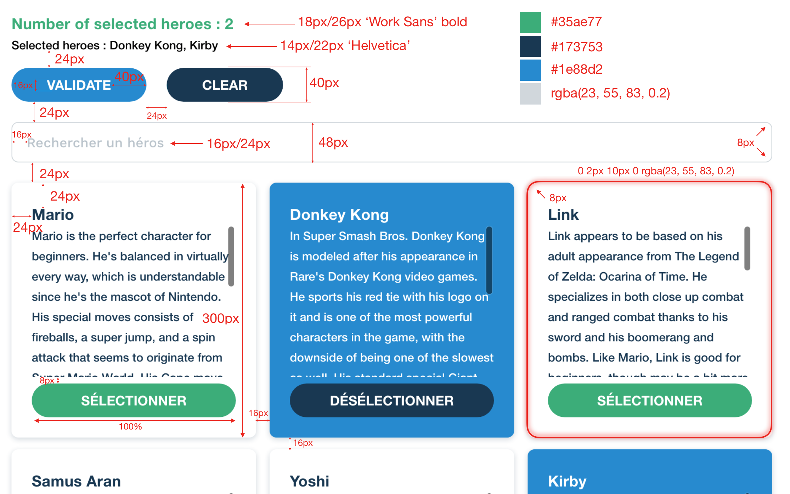

# Test de développeur front-end chez Pretto

Ce test a pour but d'évaluer votre niveau en développement front-end, React en particulier. Il a été conçu pour vous prendre environ 2h à réaliser.

Le but est de développer une mini-application en React répondant aux specs ci-dessous. Nous évaluerons le résultat selon les critères suivant, dans cet ordre : 
- est-ce que l'inteface est bien celle attendue (espaces, couleurs, comportement responsive)
- est-ce que les fonctionnalités en place correspondent aux specs (recherche, critères de validation, ...)
- est-ce que le code est lisible, maintenable, et évolutif
- est-ce que toutes les fonctionnalités sont implémentées

Derrière ça, vous êtez libre à 100% sur les décisions technique, architecturales, et de dépendances ce projet.

Si les specs ne sont pas claires ou ambigues, c'est un problème de notre côté et nous en somes désolé. Prévenez nous, on ne vous en tiendra pas rigueur, bien au contraire.

Si vous sentez que vous n'aurez pas le temps de tout faire, n'hésitez pas à laisser de côté quelques fonctionnalités. Nous préférons voir un projet solide avec moins de fonctionnalités qu'un projet buggé et/ou non-fonctionnel.

Lors des entretiens en personne, nous aurons une discussion autour du code, des choix techniques faits, et de la meilleur manière d'y apporter de nouvelles fonctionnalités.

## Instructions

- Forkez [ce repo](https://github.com/finspot/test-front.git) et clonez le localement `git clone https://github.com/<votre-identifiant>/test-front`
- Vérifiez qu'il démarre dans votre environnement de dev (`yarn install` / `yarn start`)
- Implémentez les specs ci-dessous
- Une fois terminé, pushez le code sur votre fork `git push origin master`
- Envoyez nous le lien vers votre fork

## Specs fonctionnelles

Au chargement, aucun élément n'est sélectionné.

Dans le header, le titre affiche le nombre d'éléments sélectionnés, le contenu le nom de chaque héros.

Au clic sur une Carte, celle-ci passe dans un état 'sélectionnée', on peut alors la déselectionner.

Le bouton de validation log tous les éléments sélectionnés sous format d'un tableau d'objets avec toutes ses infos (id, title, description).

La validation n'est possible que lorsqu'il y a entre 2 et 4 éléments sélectionnés. Lorsque ce n'est pas le cas, le bouton n'est pas affiché.

L'annulation désélectionne toutes les cartes sélectionnées mais garde le champs de recherche.

Le champs de recherche filtre les cartes de personnages sur leur titre. (ex. : lorsque je tape 'ar', il ne doit apparaître que les cartes de 'Mario' et 'Samus Aran')

## Résultat attendu

## Éléments graphiques

## Responsive

### Layout

La largeur max du conteneur est de 1240px. On affiche une seule carte jusqu'à 600px, 2 cartes entre 600px et 840px, 3 cartes au-delà de 840px.

### Carte

Un Carte a un padding de 16px jusqu'à 720px, 24px au-delà.
