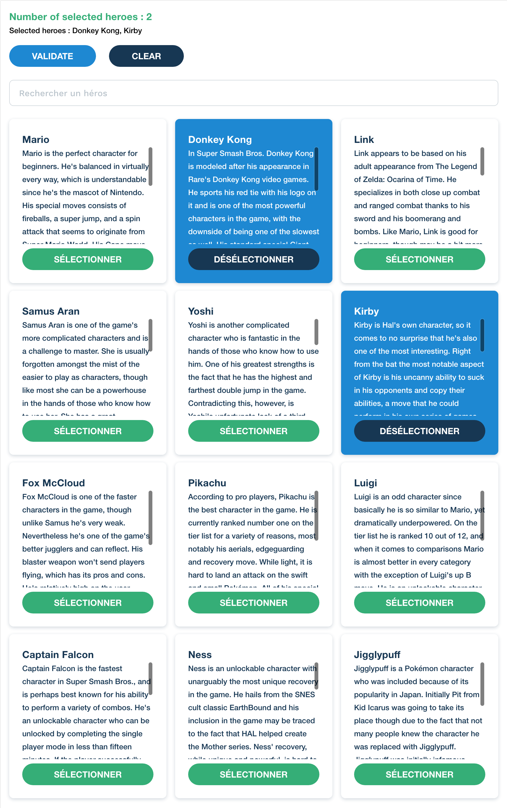

# Test de développeur front-end chez Pretto

## Instructions

Le test devrait prendre plus ou moins 2 heures à finir. Si vous dépasser un peu ce n'est pas grave. Lors de l'entretien, nous aurons une discussion sur le code, notamment comment rajouter des features.

Pour commencer, vous devrez vous cloner le repo suivant : `finspot/test-front`

Vous avez le droit d'utiliser les librairies que vous voulez. Vous gérez le CSS comme vous le voulez. Le tout doit être responsive.

Une fois le travail terminé, vous devrez le mettre en ligne.

## Specs fonctionnelles

Au chargement, aucun élément n'est sélectionné.

La carte du header affiche le nombre d'éléments sélectionnés.

Au clic sur une Carte, celle-ci passe dans un état 'sélectionnée'.

Le bouton de validation log tous les éléments sélectionnés sous format d'un tableau avec toutes ses infos (id, title, description).

## Résultat attendu



## Éléments graphiques

### Couleurs

-  #35AE77
-  #173753
-  #1E88D2

### Layout

Espacement entre le header et la liste : 24px

Espacement entre les éléments : 16px

Chaque carte doit avoir une hauteur fixe de 300px

### Titre

```
font: 18px bold;
line-height: 26px;
```

### Description

```
font-size: 14px;
line-height: 22px;
```

### Carte

```
padding: 24px;
box-shadow: 0 2px 10px 0 rgba(23, 55, 83, 0.2);
border-radius: 8px;
```

### Bouton

```
font-size: 16px;
height: 40px;
line-height: 40px;
padding: 0 40px;
border-radius: 40px;
color: #FFFFFF;
background-color: #35AE77;
text-transform: uppercase;
```

## Contenu

### Header

#### Titre

Bienvenue sur le test de Pretto

#### Description

Nombre d'éléments sélectionnés : X

#### Bouton

Valider

### Liste

cf. fichier joint : characters.js

## Responsive

### Layout

On affiche une seule carte jusqu'à 600px, 2 cartes entre 600px et 840px, 3 cartes au-delà de 840px.

### Carte

Un Carte a un padding de 16px jusqu'à 720px, 24px au-delà.
